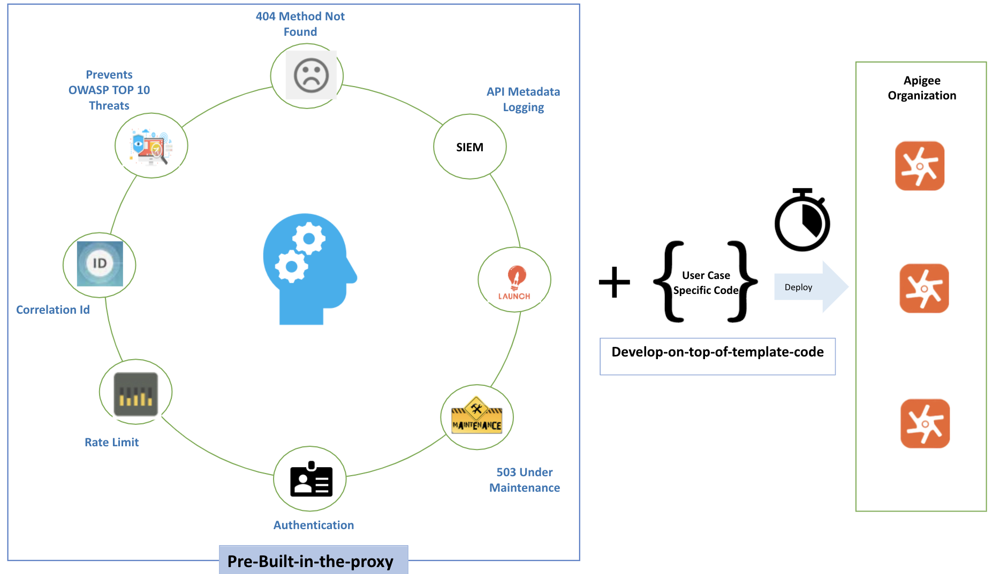

# apigee-opensource-template

Apigee - Template
===============================================

What does it do?
===============================================
This template is for use with Apigee SaaS, On prem and Hybrid implementations. It enables the user to speed up and secure the development process by deploying a structured script. This will pull an Apigee proxy bundle from the github repo and deploy to the Apigee implementation of your choice. 

Key features:-
OWASP top 10 compliance
 - Flexible template enabling customisation
 - Predefined Spike arrest, throttling, quota and authentication capability
 - Includes logging to splunk or Elastic
 
This template has saved our engineers 30-40% development time and we are delighted to support the community by making this capability available to others.
Further, Engineers who do not have an Apigee engineering background can also leverage the template. This will get your engineers shipping production code quickly and reduce their learning time.

The template is good for deployment on:

Public Cloud: A hosted SAAS version in which Apigee maintains the environment, allowing you to concentrate on building your services and defining the APIs to those services.

Apigee hybrid: Lets you manage APIs on-premises, on Google Cloud Platform (GCP), or a mix of both.

Private Cloud: An on-premises installation in which you control the hardware environment and are responsible for the installation, upgrade, maintenance, and other administrative processes.


What functionalities offered by this template ?
---

The template helps develop production-ready proxy with the below functionalities:

1. It does the authorisation check.
1. It checks if the backend is under maintenance and throws a checked exception.
1. It validates the quota. Quota is configured at the Apigee app level and is referenced in the proxy.
1. It prevents/blocks DDOS attack/Rogue client/performance testing  with Spike Arrest policy
1. It generates a correlation-id which is send to the target server for an end-to-end tracing
1. It valdates and sanitizes the incoming request and the CORS headers. 
1. It logs metadata of the API to SIEM systems such as Loggly in this case
1. It prevents the authentication header to reach the backend that is sent for proxy validation.
1. It throws the a 404 method not found/implemented exception if none of the proxy path match
1. It reduces the OWASP Top 10 Web Application Security Risks

<p align="center"></p>

Outcome/Benefit of using this template ?
--------------------
1. Reduces boiler plate code
1. Reduces the OWASP Top 10 Web Application Security Threats
1. Faster delivery of features
1. Modify this template to cater to your own user-cases


What's with the name?
--------------------
We are calling this a template as we want developers/engineers to build their proxies leveraging this as a template/prototype that boost's developer performance and reduce time-to-production. 

This template has been developed and released by The Singularity Mesh, Apigee partner of the year 2019 APAC. Please check our repo or get in touch for other additional Apigee capabilities.


What's next?
---
Check out our [roadmap](ROADMAP.md) to see what we have planned moving forward.


Quick-Start - Install Script
--------------

The `master_deploy_script.sh` under the master-script folder provides a convenient way to download the proxy and and add it to your own apigee org.

To download & deploy the proxy , checkout the code & move to the master-script folder and run:

```bash
sh master_deploy_script.sh
```

The script executes & performs the below
1. Creates the KVM config in the test env of the apigee org required by the template
1. Downloads & bundles the proxy template code from git repo and deploys it to the apigee org
1. Creates a product, developer and finally creates an app and tags the product & developer to this new created app

Steps to make the template functional in your own Apigee org
--------------
Refer to Steps_to_make_template_functional.docx in the repo

Pre-requisites
--------
1. Apigee SaaS account
2. jq installed in your system --> https://stedolan.github.io/jq/download/

Note
--------
1. When running the postman collection use your own api key that is generated when the master_deploy_script runs successfully

Issues
--------

Any issues in this can be reported by sending an email to info@the-singularity.com.au. Please do not file issues about security.
